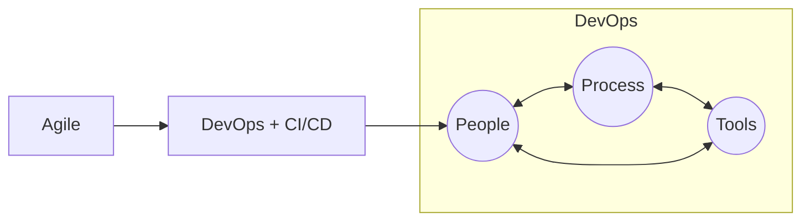

# Agile-DevOps
株式会社テクエイヴのアジャイル、DevOps、ワークフロー定義

## 目的
アジャイル＋DevOpsの導入に必要な具体的な課題を列挙して検証を行い、他のSIプロジェクトに臨む際のレファレンスと活用する。

## 課題
1. コラボレーション環境
   - アジャイル・プロジェクト管理ツール
   - Issue Tracker
   - 情報共有ツール(Knowledge Base)
   - ソース共有ツール(Version Control System)
2. 戦略・ポリシー
   - OpenSource vs InnerSource
   - Branching Strategy
3. アーキテクチャ設計
   - クラウド化
   - サーバレス設計
   - マイクロサービス
4. 試験の自動化
   - Unit Test
   - TDD
   - CI/CD Tools
